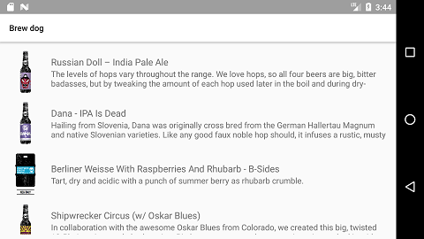

# Sytac Android assignment

## The Beer application assignment

 Create a native Android application which uses the [Punk API](https://punkapi.com/) to display a list of beers. The app should have the following features:

- The application should perform a network call to the [Punk API](https://punkapi.com/) to fetch a list of 20 beers.
- The app should have a master detail flow.
- The main page of the app should display these beers in a list with a vertical orientation.
- The detail view should contain the image of the beer, the characteristics of the beer, a description and the foods that this beer pairs well with.
- The application should support phones and tablets. On tablets it's required to take advantage of the big screen.
- The application should run on devices with minimum API 19.

### Punk API
The data are provided by the [Punk API](https://punkapi.com/).
For the sake of simplicity we filter the call to return maximum 20 results of IPA beers. The API URL you need is the following:

```
https://api.punkapi.com/v2/beers?beer_name=IPA&per_page=20
```


### Screenshots

The application should look similar with the screenshots provided below.

#### Smartphone layout
##### List:




##### Detail:


#### Tablet layout:


## Coding Assignment Evaluation Guidelines

To give you an idea what we expect from the implementation of the assignment we came up with
the following guidelines. In general, treat it as code that will go in production for one of our clients.

### Assignment
* Does the code work.
* Does the code still work when encountering edge cases.

### Code quality
* Is the code structured in a logical way.
* Could the code be extended.
* Do functions, classes and modules use the right level of abstraction.
* Does the code show software engineering best practices and design patterns where applicable.
* Is the code consistent.
* Does the code contain descriptive names.
* Is the code production ready.
* Does the code base scale to a bigger feature set.

### Frameworks + Language
* What framework was chosen.
* Are the features of the framework used according to community best practices.
* Does the code use features of the framework or language when possible.
* Are common pitfalls avoided.

### Testing
* Are there automated test.
* How are the tests written.
* What choices are made in testing certain parts of the code.
* Are the tests written with the right level of abstraction.
* What test cases are chosen.
* Does the test code make use of the features of the test framework when applicable.

### Android specific
* Does the application handle the configurations changes such as device rotation properly.
* Can the app work offline?
* Is the app designed to work on multiple devices?
* Does it follow the material design guidelines?
* Is the app optimised for performance? Can it work properly on lower end devices?

## Delivery

You are assigned to you own private repository. Please use your own branch and do not commit on master.
When the assignment is finished, please create a pull request on the master of this repository, and your contact person will be notified automatically. 